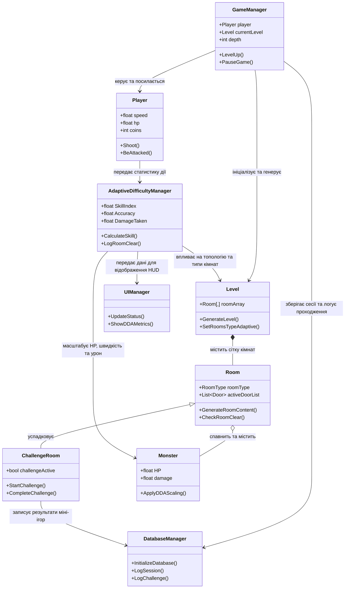

# Детальна Документація Всіх Класів Гри (Adaptive Roguelite)

Цей документ містить повний та вичерпний опис абсолютно всіх класів, інтерфейсів та допоміжних структур проекту, їх ролей, взаємозв'язків та функціонального призначення в грі.

---

## 1. Архітектура та Зв'язки між Класами (Схема)

---

## 2. Повний опис кожного класу (по категоріях)

### Категорія 1: Системи керування, збереження та звуку (Managers)

1. **`GameManager`**
   - **Роль**: Головний керуючий клас ігрового циклу.
   - **Опис**: Наслідує `Singleton<GameManager>`. Зберігає глобальні прапорці стану гри (гра триває, гра на паузі, головне меню, екран поразки). Утримує посилання на персонажа гравця, поточний рівень, глибину поверху. Забезпечує старт нової гри, перехід на наступний поверх, паузу та перезапуск.

2. **`DDAInitializer`**
   - **Роль**: Ініціалізатор систем динамічної складності та збереження при старті гри.
   - **Опис**: Статичний клас. Автоматично викликається при запуску сцени. Спавнить системні префаби `AdaptiveDifficultyManager` та `DatabaseManager` у сцені, якщо вони відсутні, для забезпечення роботи DDA і бази даних.

3. **`DatabaseManager`**
   - **Роль**: Локальна аналітика сесій на базі бази даних SQLite.
   - **Опис**: Здійснює підключення до файлу `analytics.db`. Створює таблиці сесій гравця (`sessions`) та проходження міні-ігор (`challenges`). Записує тривалість гри, результати успіху чи невдачі випробувань, а також поточний індекс майстерності гравця на момент виконання.

4. **`AudioManager`**
   - **Роль**: Процедурне та звукове супроводження гри.
   - **Опис**: Динамічно створює та відтворює звукові сигнали та ефекти різної частоти й тривалості. Використовує вбудовані аудіо-синусоїди для створення ретро-звуків без використання важких зовнішніх звукових файлів.

5. **`GameItemManager`**
   - **Роль**: Контроль за випадінням предметів.
   - **Опис**: Керує інстанціюванням ігрових сутностей (монети, серця, зброя) у просторі кімнат. Забезпечує їх координацію та завантаження відповідних префабів.

6. **`SaveLoadSystem`**
   - **Роль**: Менеджер збереження та завантаження прогресу.
   - **Опис**: Зчитує та записує стан гравця (рівень здоров'я, кількість монет, активну зброю, індекс складності DDA) у JSON-файл на диску.

7. **`SaveData`**
   - **Роль**: Контейнер збережених даних.
   - **Опис**: Допоміжний серіалізований клас всередині `SaveLoadSystem`. Зберігає значення здоров'я, монет, активної зброї, поточного поверху та коефіцієнтів складності для їх запису у файл.

8. **`StoryManager`**
   - **Роль**: Контролер сюжетних та навчальних діалогів.
   - **Опис**: Запускає текстові вікна з підказками перед стартом кімнат навчання. Відображає пояснювальні тексти та блокує дії гравця на час читання.

9. **`UIManager`**
   - **Роль**: Візуальний інтерфейс користувача.
   - **Опис**: Утримує посилання на текстові поля здоров'я, монет, ключів, бомб. Оновлює інтерфейсну DDA-панель (показує швидкість гравця, його міткість стрільби у відсотках, сумарно отриману шкоду та загальний рейтинг майстерності).

---

### Категорія 2: Керування складностями та адаптацією (DDA)

10. **`AdaptiveDifficultyManager`**
    - **Роль**: Алгоритм обчислення складності гри.
    - **Опис**: Зберігає метрики ефективності користувача. На основі кількості пострілів, влучань, отриманих ударів та швидкості зачистки кімнат вираховує значення `SkillIndex` (від 0.0 до 1.0). Передає масштабовані коефіцієнти для коригування HP ворогів, точності стрільби супротивників та структури рівнів.

---

### Категорія 3: Гравець (Player)

11. **`Player`**
    - **Роль**: Персонаж користувача.
    - **Опис**: Реалізує керування рухом через Physics2D, обробляє введення з клавіатури, стрільбу у чотирьох напрямках, нарахування монет та віднімання здоров'я при отриманні урону. Звітує про ігрову статистику в `AdaptiveDifficultyManager`.

---

### Категорія 4: Ігрові об'єкти, предмети та зброя (Items & Inventory)

12. **`GameItem`**
    - **Роль**: Базовий абстрактний клас для фізичних об'єктів у грі.
    - **Опис**: Успадковує `MonoBehaviour`. Забезпечує базову ініціалізацію та ідентифікацію об'єктів у просторі кімнат.

13. **`Item`**
    - **Роль**: Абстрактний клас для предметів, що підбираються.
    - **Опис**: Успадковує `GameItem`. Задає правила взаємодії гравця з предметом при зіткненні (колізії).

14. **`Goods`**
    - **Роль**: Товари для продажу у кімнаті магазину.
    - **Опис**: Успадковує `Item`. Містить ціну у монетах та візуальний цінник. Перевіряє наявність грошей у гравця перед покупкою предмета.

15. **`Pickup`**
    - **Роль**: Витратні предмети першої необхідності.
    - **Опис**: Успадковує `Item`. Описує об'єкти, які миттєво додаються до інвентаря гравця (ключі, бомби, монети).

16. **`Heart`**
    - **Роль**: Абстрактний клас відновлення здоров'я персонажа.
    - **Опис**: Успадковує `Pickup`. Визначає спільну поведінку для всіх типів сердець лікування.

17. **`RedHeart`**
    - **Роль**: Звичайне червоне серце.
    - **Опис**: Успадковує `Heart`. При підборі додає певну кількість одиниць здоров'я до поточної шкали гравця (якщо вона не заповнена повністю).

18. **`Coin`**
    - **Роль**: Золота монета.
    - **Опис**: Успадковує `Pickup`. Додає грошові кошти на рахунок гравця для подальшого використання у магазині або на рулетці.

19. **`Property`**
    - **Роль**: Пасивні артефакти або зброя, що змінюють характеристики гравця.
    - **Опис**: Успадковує `Item`. Надає механіку модифікації параметрів персонажа при піднятті предмета з постаменту.

20. **`CPU`**
    - **Роль**: Пасивний артефакт "Центральний процесор".
    - **Опис**: Успадковує `Property`. Підвищує швидкість стрільби гравця.

21. **`DataStructure`**
    - **Роль**: Пасивний артефакт "Структури даних".
    - **Опис**: Успадковує `Property`. Дає гравцеві додаткові контейнери для максимального здоров'я.

22. **`Internet`**
    - **Роль**: Пасивний артефакт "Мережа Інтернет".
    - **Опис**: Успадковує `Property`. Суттєво збільшує швидкість пересування персонажа.

23. **`OS`**
    - **Роль**: Пасивний артефакт "Операційна система".
    - **Опис**: Успадковує `Property`. Надає гравцеві імунітет до уповільнення або пасток.

24. **`TheBrokenHeart`**
    - **Роль**: Пасивний артефакт "Розбите серце".
    - **Опис**: Успадковує `Property`. Знижує максимальне здоров'я гравця взамін на значне збільшення його сили атаки.

25. **`Weapon`**
    - **Роль**: Базовий абстрактний клас для зброї-програм.
    - **Опис**: Успадковує `Property`. Задає шаблони для зброї, що змінює тип снарядів гравця.

26. **`Cpp`**
    - **Роль**: Зброя C++.
    - **Опис**: Успадковує `Weapon`. Стріляє важкими снарядами з великою шкодою, але має невисоку швидкість перезарядки.

27. **`Java`**
    - **Роль**: Зброя Java.
    - **Опис**: Успадковує `Weapon`. Забезпечує самонаведення снарядів на найближчих ворогів.

28. **`Machine`**
    - **Роль**: Зброя "Машинний код".
    - **Опис**: Успадковує `Weapon`. Швидкострільний кулемет із випадковим розкидом куль.

29. **`Python`**
    - **Роль**: Зброя Python.
    - **Опис**: Успадковує `Weapon`. Випускає повільні кулі, які отруюють ворогів та наносять періодичну шкоду.

30. **`SQL`**
    - **Роль**: Зброя SQL.
    - **Опис**: Успадковує `Weapon`. Снаряди пробивають ворогів наскрізь, пролітаючи крізь них.

---

### Категорія 5: Вороги та Штучний Інтелект (Monsters)

31. **`Monster`**
    - **Роль**: Базовий інтелект ворогів.
    - **Опис**: Успадковує `GameItem`. Визначає загальну поведінку монстрів, їх пересування до гравця, отримання шкоди, смерть та застосування DDA коефіцієнтів до показників здоров'я, швидкості та атаки.

32. **`children`**
    - **Роль**: Ворог "Дитина".
    - **Опис**: Успадковує `Monster`. Слабкий ворог ближнього бою, який хаотично бігає за гравцем та має невелику кількість здоров'я.

33. **`teenager`**
    - **Роль**: Ворог "Підліток".
    - **Опис**: Успадковує `Monster`. Ворог середньої складності, що тримається на відстані від гравця та випускає поодинокі снаряди.

34. **`underGraduate`**
    - **Роль**: Ворог "Студент".
    - **Опис**: Успадковує `Monster`. Швидкий та небезпечний ворог, який періодично здійснює різкі ривки в бік персонажа.

35. **`SBsuizhiyuan`**
    - **Роль**: Головний бос гри.
    - **Опис**: Успадковує `Monster`. Має велику кількість здоров'я, стріляє віялом куль у кількох напрямках та періодично спавнить міньйонів (не більше 5 штук одночасно) для захисту.

---

### Категорія 6: Генерація рівнів та кімнати (Levels & Rooms)

36. **`Level`**
    - **Роль**: Менеджер та генератор поверхів.
    - **Опис**: Будує сітку поверху. Зчитує `SkillIndex` гравця і визначає складність генерації. Розподіляє типи кімнат по поверху та перевіряє, щоб скарбниці або магазини не блокували основний прохід, створюючи міні-ігри на шляху гравця.

37. **`Pool`**
    - **Роль**: Сховище префабів та пулів об'єктів для поверху.
    - **Опис**: Зберігає колекції монстрів, скринь, пасивних предметів, зброї та елементів оточення для процедурної генерації сцени.

38. **`LevelUp`**
    - **Роль**: Люк переходу на наступний поверх підземелля.
    - **Опис**: Об'єкт-тригер. При зіткненні з гравцем після перемоги над босом активує перехід на новий рівень та оновлює глибину підземелля.

39. **`Room`**
    - **Роль**: Базовий функціонал ігрової кімнати.
    - **Опис**: Відстежує стан дверей (відкриті/закриті), спавнить ворогів та перешкоди. Містить перевірку безпечних коридорів (Safety Zones), яка не дозволяє генератору ставити каміння або ящики перед активними дверима та вздовж прямих ліній ходьби до центру.

40. **`CombatRoom`**
    - **Роль**: Кімната бойових дій.
    - **Опис**: Успадковує `Room`. Спеціалізується на закритті дверей при вході гравця та спавні хвиль ворогів відповідно до складності DDA. Відкриває двері після повного знищення ворогів.

41. **`SpecialtyRoom`**
    - **Роль**: Спеціальна мирна кімната.
    - **Опис**: Успадковує `Room`. Використовується для створення Магазинів (де розміщуються товари класу `Goods`) або Скарбниць (де спавняться предмети на постаментах).

42. **`ChallengeRoom`**
    - **Роль**: Базовий клас для кімнат випробувань.
    - **Опис**: Успадковує `Room`. Автоматично зачиняє двері при вході, виводить на стіну текстову назву випробування, запускає логіку міні-гри, фіксує результати в аналітику через `DatabaseManager` та спавнить нагороду в разі успіху. Містить вбудовані процедурні генератори спрайтів для візуалізації ігрових елементів.

---

### Категорія 7: Класи та тригери міні-ігор

43. **`ThreeCardsMonte`**
    - **Роль**: Міні-гра "Три карти (Наперстки)".
    - **Опис**: Успадковує `ChallengeRoom`. Спавнить 3 об'єкти карт із процедурно згенерованим спрайтом сорочки. Одна карта дає предмет-нагороду, друга спавнить ворога-пастку, третя є порожньою. При виборі будь-якої карти випробування завершується.

44. **`MonteCard`**
    - **Роль**: Тригер карти для гри "Три карти".
    - **Опис**: Компонент на кожній з трьох карт. Реалізує подію `OnTriggerEnter2D`. При наступанні гравця повідомляє батьківський клас `ThreeCardsMonte` про вибір відповідного варіанту.

45. **`SequenceMemoryChallenge`**
    - **Роль**: Міні-гра "Плитки пам'яті".
    - **Опис**: Успадковує `ChallengeRoom`. Тимчасово зупиняє рух гравця, відтворює випадкову послідовність спалахів плиток та звукових сигналів. Після цього активує введення та очікує, поки гравець наступить на плитки у вірному порядку.

46. **`MemoryButtonTrigger`**
    - **Роль**: Тригер плитки для пам'яті послідовностей.
    - **Опис**: Відслідковує наступання гравця на конкретну кольорову плиту та передає її ідентифікатор у скрипт `SequenceMemoryChallenge`.

47. **`RouletteWheel`**
    - **Роль**: Міні-гра "Рулетка удачі".
    - **Опис**: Успадковує `ChallengeRoom`. Спавнить центральний автомат із круглим різнокольоровим колесом та дві плити (запуск рулетки за 5 монет та вихід). Залежно від обертання гравець отримує випадковий корисний предмет, дрібний лут, або автомат вибухає, наносячи шкоду.

48. **`RouletteButtonTrigger`**
    - **Роль**: Плити керування рулеткою.
    - **Опис**: Обробляє зіткнення з гравцем. Передає в `RouletteWheel` команду запуску обертання або команду завершення гри та відкриття дверей кімнати.

49. **`TimeMazeChallenge`**
    - **Роль**: Міні-гра "Лабіринт часу".
    - **Опис**: Успадковує `ChallengeRoom`. Переміщує гравця в лівий кінець кімнати, створює лабіринт зі стін-блоків та фінішну зону в правому кінці. Запускає таймер. Гравець має добігти до фінішу до завершення часу, інакше отримає шкоду.

50. **`MazeFinishTrigger`**
    - **Роль**: Фінішна зона лабіринту.
    - **Опис**: Реалізує тригер реєстрації прибуття гравця на точку фінішу для зарахування успіху в `TimeMazeChallenge`.

51. **`ObserverRoom`**
    - **Роль**: Міні-гра "Око спостерігача".
    - **Опис**: Успадковує `ChallengeRoom`. Розміщує на верхній стіні ока-спостерігачі. Періодично змінює їх стан: закриті (зелені, рух дозволено) та відкриті (червоні, рух заборонено). Якщо гравець рухається при відкритих очах, він отримує шкоду. Мета — дійти до протилежного кінця кімнати.

52. **`ObserverFinishTrigger`**
    - **Роль**: Фінішна зона спостерігача.
    - **Опис**: Реєструє зіткнення з гравцем на протилежній стороні кімнати та завершує гру перемогою.

53. **`ChangingSafeZones`**
    - **Роль**: Міні-гра "Безпечні зони".
    - **Опис**: Успадковує `ChallengeRoom`. Наносить постійну періодичну шкоду гравцеві, якщо той знаходиться у відкритій зоні кімнати. Персонаж повинен стояти всередині круглого зеленого острівця безпеки, який кожні кілька секунд випадково змінює координати на підлозі.

54. **`SafeZoneHelper`**
    - **Роль**: Тригер зони безпеки.
    - **Опис**: Повідомляє клас `ChangingSafeZones`, чи перебуває гравець у даний момент всередині безпечної зони, чи вийшов за її межі.

---

### Категорія 8: Конфігураційні ресурси (ScriptableObjects)

55. **`RoomLayout`**
    - **Роль**: Шаблон структури кімнати.
    - **Опис**: Успадковує `ScriptableObject`. Містить масив символів або ідентифікаторів, які визначають, де на сцені мають з'являтися стіни, перешкоди, вороги чи предмети при ініціалізації кімнати.

56. **`ItemPool`**
    - **Роль**: База даних предметів.
    - **Опис**: Успадковує `ScriptableObject`. Зберігає список префабів предметів, що належать до конкретного ігрового пулу (наприклад, пул скарбниці, пул боса чи пул магазину).

---

### Категорія 9: Візуальні ефекти, інтерфейс та допоміжні утиліти (Utils & Core UI)

57. **`MiniMap`**
    - **Роль**: Карта поверху на екрані.
    - **Опис**: Малює схему пройдених кімнат підземелля на екрані, підсвічуючи поточне положення гравця, скарбниці, магазини та кімнату боса.

58. **`HP`**
    - **Роль**: Візуальні сердечка здоров'я в HUD.
    - **Опис**: Оновлює ряд сердечок у верхньому лівому куті екрана. Показує повні, половинні або порожні серця відповідно до поточного значення здоров'я гравця.

59. **`Singleton<T>`**
    - **Роль**: Базовий клас для паттерну Синглтон.
    - **Опис**: Узагальнений клас, який гарантує наявність лише одного екземпляра певного об'єкта (наприклад, менеджера) у сцені та надає до нього глобальний доступ через статичну властивість `Instance`.

60. **`SimplePair<T1, T2>`**
    - **Роль**: Контейнер пари значень.
    - **Опис**: Утилітарний допоміжний серіалізований клас для спрощення зберігання парних об'єктів у Unity Inspector.

61. **`SimplePairWithGameObjectInt`**
    - **Роль**: Спеціалізована пара GameObject та цілого числа.
    - **Опис**: Наслідує `SimplePair<GameObject, int>`. Використовується для налаштування ймовірностей випадіння конкретних об'єктів у Unity Inspector.

62. **`SimplePairWithGameObjectVector2`**
    - **Роль**: Спеціалізована пара GameObject та координат Vector2.
    - **Опис**: Наслідує `SimplePair<GameObject, Vector2>`. Використовується для фіксованого розміщення об'єктів на карті.

63. **`RandomGameObject`**
    - **Роль**: Об'єкт із випадковим шансом появи.
    - **Опис**: Допоміжний клас, що визначає можливість спавну конкретного об'єкта на основі випадкового відсотка.

64. **`RandomGameObjectTable`**
    - **Роль**: Таблиця випадкового вибору об'єктів.
    - **Опис**: Містить список пар `SimplePairWithGameObjectInt` та повертає випадковий об'єкт на основі заданих ваг (шансів).

65. **`RandomItemFromPool`**
    - **Роль**: Спавнер випадкового предмета з пулу.
    - **Опис**: Звертається до `Pool` та замінює себе випадковим артефактом під час генерації кімнати.

66. **`VFXHelper`**
    - **Роль**: Спавнер ефектів часток.
    - **Опис**: Динамічно створює частки вибухів, пилу чи іскор у точці смерті ворогів або влучання куль.

---

### Категорія 10: Бойові снаряди та зброя (Weapons & Projectiles)

67. **`Gun`**
    - **Роль**: Базовий клас стрілецької зброї.
    - **Опис**: Визначає загальні параметри стрільби (час перезарядки, кількість набоїв, точність). Отримує кут розсіювання від системи DDA та випускає кулі при натисканні клавіш стрільби.

68. **`Pistol`**
    - **Роль**: Базовий стартовий пістолет.
    - **Опис**: Успадковує `Gun`. Має нескінченні набої, стріляє поодинокими кулями з середньою швидкістю.

69. **`Rifle`**
    - **Роль**: Штурмова гвинтівка.
    - **Опис**: Успадковує `Gun`. Дозволяє стріляти чергами при утриманні клавіші стрільби.

70. **`Shotgun`**
    - **Роль**: Дробовик.
    - **Опис**: Успадковує `Gun`. Випускає відразу 5 куль віялом, що наносить велику шкоду на близькій відстані.

71. **`RocketLauncher`**
    - **Роль**: Ракетна установка.
    - **Опис**: Успадковує `Gun`. Випускає важкі ракети класу `Rocket`, які вибухають при зіткненні.

72. **`Lasergun`**
    - **Роль**: Лазерна зброя.
    - **Опис**: Успадковує `Gun`. Випускає безперервний промінь, що миттєво перетинає кімнату та наносить періодичну шкоду ворогам на своєму шляху.

73. **`Bullet`**
    - **Роль**: Звичайний снаряд зброї.
    - **Опис**: Рухається у заданому напрямку зі сталою швидкістю. При зіткненні з ворогом наносить шкоду і руйнується.

74. **`BulletShell`**
    - **Роль**: Декоративна відстріляна гільза.
    - **Опис**: Вилітає зі зброї при пострілі, падає на підлогу та зникає через кілька секунд.

75. **`BulletTracer`**
    - **Роль**: Лінія трасування польоту кулі.
    - **Опис**: Малює швидкий візуальний слід за кулею для кращої видимості пострілів.

76. **`Rocket`**
    - **Роль**: Снаряд ракетної установки.
    - **Опис**: Повільно прискорюється у повітрі. При зіткненні з будь-якою стіною або ворогом створює об'єкт вибуху `Explosion`.

77. **`Explosion`**
    - **Роль**: Фізична зона вибуху.
    - **Опис**: Спавниться ракетами або бочками. Наносить велику шкоду всім ворогам та гравцеві в межах свого радіуса дії, після чого знищує себе.

78. **`ObjectPool`**
    - **Роль**: Пулінг об'єктів для оптимізації продуктивності.
    - **Опис**: Зберігає деактивовані копії снарядів (куль та гільз) у пам'яті. Замість створення нових об'єктів через `Instantiate` під час інтенсивної стрільби, перевикористовує існуючі, що знижує навантаження на систему збору сміття (Garbage Collector).
